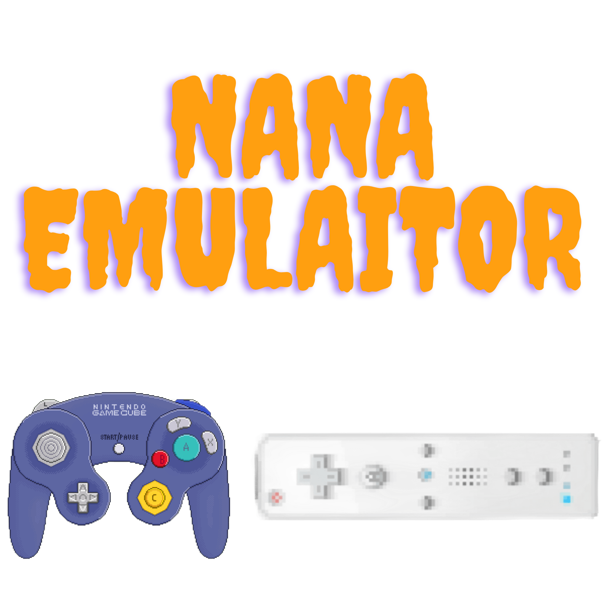

  

# 🇧🇷 Central de Emulação Wii & Homebrew (PT-BR)

Bem-vindo ao repositório oficial do projeto! Este espaço foi desenvolvido com um propósito único e exclusivo: fornecer todos os guias, tutoriais, ferramentas e instruções **100% em Português do Brasil (PT-BR)** para a emulação de Nintendo Wii. 
